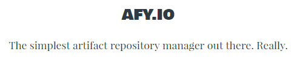

<h1 align="center">
  
</h1>

### Roadmap/Features for v0.1-beta
- [ ] File Browser
  - [x] Show directories
  - [x] "Root"-folder breakout prevention
  - [ ] Calculate a directories complete size (recursive through all subfolders)
  - [ ] Cache directory structure (hhoweyc/fsnotify)
  - [ ] Enable/Disable static-file-cache for content under a specific threshold
- [x] ACP
  - [x] OAuth
    - [x] Github
    - [x] ~~Google~~ _Not in v0.1-beat (moved to later versions)_
  - [x] OAuth-Provider-ID comparison with "Whitelist-file"
  - [x] SSO (Github-Organization) -> allow if user is member of x
  - [x] Access-Log
- [x] Server
  - [x] TLS support
  - [x] Enable/Disable Gzip compression (NYTimes/gziphandler)
- [ ] Config
  - [x] Server config through flags
  - [x] Server config in YAML format
  - [ ] Package configs in YAML format
- [ ] Advanced VCS-Support (Git)
  - [x] Automatically load if `_gif.afy` is present in the current folder
  - [x] Commit-ID (SHA hash)
  - [x] Commit-Link
  - [ ] Commit-Author (Name, Email, Link)
  - [x] Commit-Message
- [x] Advanced CI-Support
  - [x] Automatically load if `_ci.afy` is present in the current folder
  - [x] Job-ID
  - [x] Build-Link
  - [x] Build-time
  - [x] Code-Coverage
  - [x] Link to coverage report (just points to `_coverage.afy` in the same folder)
- [ ] Advanced "Package"-support
  - [ ] Automatically load if `_package.afy` is present in the current folder or in any of the parent directories
  - [x] Name
  - [x] Hierarchy
  - [x] Depends on list (including links to the packages "Root"-folder)
